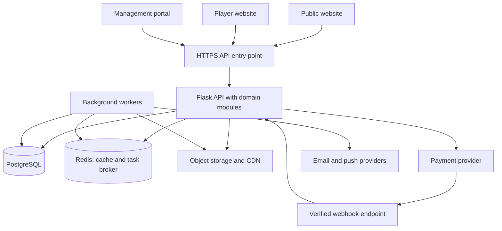

# Sports platform architecture proposal

This is a proposed blueprint for growing the dhoyo/Ring beta into a social network for player development and competition. The core is player identity, content, relationships, recognition, team opportunities, and participation in tournaments, including national and international events hosted by the platform's own organization. Venue booking supports this experience. This document does not implement or deploy the architecture. The initial sport, market, expected traffic, budget, and development team have not been specified, so the launch design favors a small team and a focused sports pilot.

## Product core and player progression

The intended experience is: create a sporting identity, share highlights, connect with players/coaches/teams, join a squad, compete, record confirmed results and achievements, and discover the next eligible competition.

The social website should foreground Home/Feed, Discover Players, Communities/Squads, Compete, Messages, and My Profile. Booking is a supporting feature within relevant games/events or an optional secondary area.

Distinguish audience growth from competition progression:

- Social growth: followers, highlights, discussions, profile views and relevant connections.
- Sporting growth: participation, confirmed results, achievements, coaching and team opportunities.
- Competition progression: explicit eligibility and qualification rules connecting events in a circuit.

Followers and inherited captain visibility may help a player get discovered. Qualification into a higher competition must follow published sporting and eligibility rules. A popular profile does not automatically earn a national or international competition place.

The platform company is itself an organizer organization using the same organization/competition boundaries as other approved organizers. Platform-wide moderation privileges remain separate from organizer privileges.

Proposed circuit model: a season contains local qualifiers, regional events, a national final, and an international event where appropriate. These are configured pathways rather than an automatic entitlement. Store parent circuit, season, event scope, accepted countries, eligibility policy, advancement rules, result provenance and organizer identity. Record any external recognition/sanctioning separately from event scope.

## Closest product precedents

This product model has substantial precedents; the opportunity is in the chosen sports, community experience, trustworthy records, accessible opportunities and event execution.

- FieldLevel is an athletic network connecting athletes, coaches and teams, with profiles and recruiting opportunities: [official overview](https://support.fieldlevel.com/en/articles/811842-what-is-fieldlevel-and-how-does-it-work).
- Challengermode combines esports communities and tournaments, including national leagues, and reports use for global competitions: [community/national league guide](https://support.challengermode.com/en/start-here/how-to-sign-up-to-challengermode), [official company description](https://careers.challengermode.com/).
- UTR Sports links player profiles and verified sporting ratings with a Pro Tennis Tour: [verified ratings](https://www.utrsports.net/pages/how-utr-works), [tour](https://www.utrsports.net/pages/pro-tennis).
- Playtomic documents both a social feed and tournament discovery/entry: [community](https://playerhelp.playtomic.com/hc/en-gb/articles/19831992618769-Playtomic-Community), [tournaments](https://playerhelp.playtomic.com/hc/en-gb/articles/19831745721617-How-to-join-a-Tournament).
- FACEIT documents finding teammates for matchmaking, clubs, tournaments and leagues: [Party Finder](https://support.faceit.com/hc/en-us/articles/14996733545884-Intro-and-overview-of-Party-Finder).

These sources establish overlaps, not an exhaustive audit of every product's private or undocumented features. The beta's precise captain-award-to-member feed formula remains a narrower differentiation hypothesis.

## Starting point

- Python/Flask currently exposes the social and arena APIs and serves the browser UI.
- Players, communities, teams, fixtures, awards, posts, and preferences share one PostgreSQL JSONB state record. Requests serialize access to this record.
- The original users table is separate from player identities.
- Visitors share `demo-user`; organizer authority uses a client-supplied demo header.
- Bookings and tournament registration screens use browser-local demo state.
- Captain-to-member influence is implemented in post ranking. It is separate from earned awards and applies only to eligible feeds and matching sports.

The first migration is authenticated identities and structured domain tables. Splitting the current files into independently deployed containers would preserve the existing data and trust limitations.

## Websites and audiences

The hostnames below are examples using an unregistered placeholder domain. All portals share account identity; API authorization determines access.

| Website | Audience | Main workflows |
| --- | --- | --- |
| `www.yourbrand.example` | Public visitors | Player-development mission, public player/event pages, circuit information, help, organizer applications |
| `app.yourbrand.example` | Players, captains and coaches | Feed/highlights, profiles, connections, messages, communities, squads, competitions and achievements; supporting bookings |
| `organize.yourbrand.example` | Platform event team, clubs and other organizers | Circuits, seasons, eligibility, qualifiers, registration, rosters, check-in, fixtures, results, award issuance |
| `venues.yourbrand.example` | Venue operators | Courts, facilities, availability, closures, prices, reservation operations, payment status |
| `admin.yourbrand.example` | Platform staff | Organization review, moderation, disputes, support, role-controlled financial operations, audit review |

Launch can use three frontend deployments: public website, player app, and a management portal with separate organizer, venue, and platform-staff areas. The management portal can later become three separate deployments. Separate domains alone do not create a permission boundary.

Use a monorepo and shared UI components, design tokens, authentication integration, and generated API clients. Separate sites should share these packages rather than copy them. Start with responsive web; native mobile apps can consume the same APIs later.

## Target service boundaries

These are business modules first and candidate independently deployed services later. A service owns changes to its data; other services access it through APIs or events.

| Module / future service | Responsibilities | Owned records |
| --- | --- | --- |
| Identity and organizations | Account identity mapping, organizations, memberships, invitations, scoped staff roles | Accounts, organizations, memberships, invitations, role grants |
| Player profiles | Personal profile, per-sport settings, preferences and privacy | Profiles, player sports, preferences |
| Communities and squads | Communities, teams, captain roles, applications, member approval and capacity | Communities, community memberships, squads, squad memberships, join requests |
| Social | Posts/highlights, stories, follows, reactions, saves, comments and player/team communication | Posts, follows, reactions, comments, saves, story expiry; conversation/message records when introduced |
| Games and participation | Game creation, rosters, attendance, results and result confirmation | Games, participants, attendance records, result revisions |
| Competitions | Circuits, seasons, tournament/league registration, eligibility, qualification, divisions, scheduling, brackets and standings | Circuits, seasons, competitions, eligibility policies, qualification rules/decisions, entries, rounds, fixtures, standings projections |
| Venues and booking | Facility inventory, opening hours, closures, prices, time holds and reservations | Venues, resources/courts, availability rules, price rules, holds, bookings |
| Recognition | Authorized awards linked to eligible results, per-sport achievement history, revocation | Award definitions, issued awards, revisions/revocations, reputation projections |
| Discovery | Feed ranking, player/game search, captain influence, read models | Search/feed projections, computed influence, ranking versions |
| Payments | Provider integration, orders, charges, refunds, platform fees and payout tracking | Orders, payment attempts, provider events, ledger entries, refunds, payout records |
| Notifications | Email, push and transactional reminders | Preferences, templates, scheduled deliveries, delivery attempts |
| Media | Upload authorization, processing, ownership and access | Media metadata, processing status; files in object storage |
| Trust and support | Reports, moderation, organization review, disputes and support cases | Reports, review cases, decisions, audit events |

An API edge layer exposes the public APIs, applies request limits, validates authentication, and routes requests. Business services still enforce object- and organization-level permissions. Communication is part of the social product: introduce team/event discussions early and direct messages with blocking/reporting as the network develops. A separately deployed real-time chat service can follow demonstrated workload needs.

Keep canonical match results in Games. Competitions owns the competition format, schedule and derived standings. Recognition owns award issuance. Discovery consumes these records to produce rankings without changing results or awards.

## Initial deployment



The initial edge can be the hosting platform's HTTPS routing plus API middleware. A separately operated API gateway is unnecessary for the first release. API and worker are separate processes/deployments; the modules initially share one application release. Worker processes receive independent task queues when workload isolation becomes useful.

## Technology choices

| Layer | Recommended starting choice | Purpose |
| --- | --- | --- |
| Frontends | React + TypeScript; Next.js for public pages and portals | Shared UI, routing, server-rendered public content |
| API | Existing Flask/Python with domain modules | Preserve useful beta code while introducing proper boundaries |
| Database mapping/migrations | SQLAlchemy + Alembic | Structured records and versioned database changes |
| Primary database | Managed PostgreSQL | Accounts, memberships, results, bookings and financial records |
| Background jobs | Celery with Redis | Reminders, media processing, email, projection updates and hold expiry |
| Caching | Redis | Rebuildable feed caches and rate-limit counters |
| Media | S3-compatible object storage + CDN | Images and later video; database stores references |
| Login | Standards-based managed identity provider using OIDC | Account login, verification and staff MFA |
| Payments | Provider offering marketplace payments in the launch country | Charges, refunds and partner payout integration |
| Search | PostgreSQL indexes/full-text initially | Player, game and venue discovery; dedicated search can follow measured need |
| Delivery | Docker and GitHub Actions | Repeatable builds, checks and deployment |
| Operations | Structured logs, request IDs, error tracking, metrics and backups | Diagnose failures and restore data |

Redis caches and task queues are not the source of truth for payments, bookings or earned awards. Store durable business state in PostgreSQL. Video transcoding and real-time chat should follow the initial pilot because they introduce additional operating workloads.

## Database structure and ownership

Start with one managed PostgreSQL deployment and structured tables grouped by domain. Module interfaces govern writes. After a module becomes an independent service, give it a separate database or schema plus a dedicated database role; move to separate database deployments when isolation and load justify it.

Example schema groups:

```text
identity: accounts, organizations, organization_memberships, role_grants
profiles: player_profiles, player_sports, preferences
community: communities, community_memberships, squads, squad_memberships, join_requests
social: posts, follows, reactions, comments, saves, stories
games: games, participants, attendance, result_revisions
competitions: circuits, seasons, competitions, eligibility_policies, qualification_rules, qualification_decisions, entries, rounds, fixtures, standings
booking: venues, resources, availability_rules, price_rules, holds, bookings
recognition: award_definitions, issued_awards, award_revisions, reputation_projection
payments: orders, payment_attempts, provider_events, ledger_entries, refunds, payouts
delivery: notification_preferences, deliveries, media_assets
trust: reports, cases, decisions, audit_events
```

Important modeling rules:

- Use stable IDs for users, authors, memberships, and follows; display names can change.
- Users can belong to multiple organizations with different roles. Check the organization and object on every restricted action. Platform-wide privileges are separate grants.
- Model community membership separately from squad membership and game participation.
- Store achievements and sporting statistics by `(player_id, sport_id)`; editing profile interests cannot change award provenance.
- Store awards as issued records with match/result reference, issuer, category, timestamp and status. Counts and rankings are derived views. Define duplication and eligibility rules explicitly.
- Keep skill estimates, attendance reliability, community support, and inherited feed visibility as separate signals.
- Use foreign keys and unique/check constraints within an owned database. Cross-service references use IDs, validation APIs and projections; independent databases do not share foreign keys.
- Prevent overlapping active reservations at the database level. For variable durations, use PostgreSQL range/exclusion constraints; fixed-slot systems can use unique active-slot ownership.
- Store money in integer minor units plus currency. Keep an auditable ledger rather than only an editable payment-status field.
- Use indexes and cursor pagination for feeds, rosters, games and histories.
- Store timestamps in UTC and keep the venue's IANA timezone for display and availability calculations.
- JSONB remains useful for flexible metadata, rather than serving as the entire shared application state.

## Service communication and consistency

Interactive requests use versioned HTTP APIs. Background side effects use durable events, with a transaction outbox that records an event in the same database transaction as its business change. A relay publishes pending events after commit. Consumers deduplicate event IDs and tolerate retries and reordered delivery.

Example events:

```text
squad.member_approved.v1
game.result_finalized.v1
award.issued.v1
award.revoked.v1
booking.hold_created.v1
payment.succeeded.v1
payment.refunded.v1
booking.confirmed.v1
```

Every event includes an event ID, source entity ID, entity version, occurrence time, relevant organization ID and schema version. Include only the personal data needed by the recipient.

An award event updates Discovery's projection and schedules a notification. Recognition remains the authority for awards. Discovery projections can be rebuilt; projection lag must not permit an unauthorized award.

Critical eligibility checks use authoritative data. For example, award issuance requires organizer permission for the relevant organization, an eligible finalized result, confirmed participant identity and a valid award policy. A stale feed projection cannot authorize it.

### Booking and payment example

1. Booking atomically creates a short-lived hold if the resource is available.
2. Payments creates a provider payment request using an idempotency key and booking reference.
3. A verified provider webhook is durably recorded and deduplicated. The browser success page cannot confirm payment.
4. Payments records the financial change and an outbox event in one transaction.
5. Booking consumes the payment event and confirms only a valid held reservation.
6. If the hold expired or confirmation is impossible, the workflow initiates a refund/reconciliation task; it cannot silently create a conflicting booking.
7. Booking writes its confirmation event, which triggers player/venue notifications.

Independent payment and booking services require an explicit workflow with retries and compensating actions. They cannot rely on a transaction spanning both databases. Initially these modules can coordinate within the same application, while retaining the same state transitions and provider reconciliation rules.

## Authorization and operations

- Replace `demo-user` with authenticated identity and map existing users/player IDs deliberately.
- Remove the client-supplied organizer header as an authority. Derive permissions from authenticated identity and organization membership.
- Require staff MFA for platform administration and sensitive financial actions.
- Restrict the current unrestricted user-directory routes to their intended audience.
- Verify payment webhooks; protect cookie-based write requests against CSRF; restrict CORS to the intended frontend origins.
- Use separate production and staging credentials, deployment environments, and databases.
- Keep secrets outside the repository and browser bundle.
- Record actors and reasons for award changes, result amendments, moderation actions and refunds.
- Monitor API error rates, queue lag, payment reconciliation, booking conflicts and notification failures.
- Back up the database and exercise a restore before depending on it for real reservations.
- Test concurrency for the last available slot, repeated payment events, duplicate awards, cross-organization access and revocation updates.

## Migration from this repository

1. Introduce database migrations, account identity, organization membership and server-enforced roles.
2. Create structured profile, squad, community and social tables. Import the existing JSON state with an explicit map of sample versus real data. Seed data must remain visibly marked and cannot become verified history.
3. Cut over module by module with backups, record-count checks and a planned rollback. Avoid indefinite dual writes to JSON and relational tables.
4. Add real game creation, roster consent, attendance, result confirmation and award issuance/revocation.
5. Rebuild captain influence and feed ranking from authenticated memberships and sport-specific recognition. Version the formula and measure exposure for new players.
6. Replace browser-local competition registration with server-side entry, eligibility checks, roster snapshots, qualification decisions and published advancement rules.
7. Introduce competition entry payments and prize-payment tracking where required, including refunds and reconciliation. Replace browser-local venue booking when reservation handling becomes a concrete supporting need.
8. Expand the management portal and progressively separate workloads where there is a concrete scaling or release-isolation need.

## Build order

| Stage | Deliverable | Evidence needed to move forward |
| --- | --- | --- |
| Foundation | Real accounts, permissions, organizations, migrations, structured tables | Separate users and organizations cannot modify each other's restricted records |
| Social sports pilot | Player profiles/highlights, follows, discussions, squads, real games, results and awards | Players connect, participate and return; award provenance is inspectable |
| Competition circuit | Organizer portal, registration, eligibility, qualifiers, finals, notifications and required entry-payment workflows | Published advancement works, entries are accountable and confirmed results update profiles |
| National/international expansion | Additional events and organizer operations, localization/timezones, country eligibility and relevant payment support | Events deliver the promised player experience and sporting opportunities |
| Supporting infrastructure | Venue reservations where needed, separate worker pools, discovery/search and selective service extraction | Measured event or workload needs justify additional systems |

Extract Notifications/Media workers and Discovery workloads first when useful. Isolate Competitions/Recognition when result integrity, release ownership or event workloads warrant it, and Payments when financial workflows warrant it. Booking stays a supporting module and can be extracted if operational needs grow. Identity, profiles and community modules can remain together until independent release or scaling requirements justify separation. Kubernetes and a streaming platform can be evaluated after a smaller deployment becomes insufficient.

## Organization responsibilities

The business needs five functions; early team members can cover several:

- Product and engineering: user workflows, development, testing and reliability.
- Competition and partner operations: platform-hosted events, clubs, organizers, qualification administration, referees/result reporting and supporting venue coordination.
- Community and trust: squad growth, attendance issues, award review and moderation.
- Support and finance: event-entry issues, reconciliation, refunds, prize/partner payment records and supporting booking issues.
- Growth: local acquisition, partnerships, activation and repeat participation.

A microservice count does not determine an organization chart. Assign clear ownership of real-world game operations and financial workflows alongside software ownership.

## Budget assumptions

The existing Render/Neon setup can remain a development starting point. This proposal does not quote hosting prices or guarantee a free production deployment. Separate APIs, workers, media delivery, identity, payment transactions and reliable backups introduce usage and operating costs. Estimate these from the intended pilot's users, games, images, emails, worker activity and availability requirements before choosing plans.

## Primary references

- [Microsoft: data ownership per microservice](https://learn.microsoft.com/en-us/dotnet/architecture/microservices/architect-microservice-container-applications/data-sovereignty-per-microservice)
- [SQLAlchemy documentation](https://docs.sqlalchemy.org/)
- [Alembic documentation](https://alembic.sqlalchemy.org/en/latest/)
- [Celery introduction](https://docs.celeryq.dev/en/stable/getting-started/introduction.html)
- [Next.js documentation](https://nextjs.org/docs)
- [Stripe marketplace integration documentation](https://docs.stripe.com/connect)
